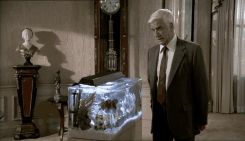

# giferator

Always dreamt of creating your own fancy gifs? Dream no more!

You can put text captions into the gifs and even reverse scenes!

## Usage

Described here are the parameters available and their usage for generating the gifs shown in this readme.

### Parameters

| Name | Description | Example | Optional? |
|------|-------------|---------|-----------|
| --start | Defines when the gif recording in the video should start | `--start "5:35"` | No |
| --duration | Sets how many seconds of video material is used for the gif | `--duration 5` | No |
| --input | File path to the video the gif should be created from | `--input source/video.mp4` | No |
| --out | File path of the resulting gif | `--out output/example.gif` | No |
| --text | Text to be displayed in the gif. It will be horizontally centered with (currently) not customizable paddings. | `--text "Lorem ipsum"` | Yes |
| --image-scale | Defines how much the gif images get scaled. Defaults to 0.5 | `--image-scale 0.9` | Yes |
| --reverse | Whether or not the gif should play in reverse. Defaults to false. | `--reverse` | Yes |
| --optimize-size | Tries to perform some compression on the gif. Does not work well and has additional dependency requirements | `--optimize-size` | Yes |

### Gif without caption

`python .\giferator.py --start "19:19" --duration 5 --input .\source\video2.avi --out .\output\nakedgun.gif --image-scale 0.7`

### Gif with caption

`python .\giferator.py --start "17:30" --duration 5 --text "Me taking out trash mobs" --input .\source\video.mp4 --out .\output\example_caption.gif`

### Reversed gif with caption

`python .\giferator.py --start "17:30" --duration 5 --text "Me hearing boss music playing" --input .\source\video.mp4 --out .\output\example_reversed.gif --reverse`

## Dependencies

The following dependencies are required to run giferator:

* opencv-python
* imageio

If you wish to use the compression flag (--optimize-size) you need to additionally install [pygifsicle](https://pypi.org/project/pygifsicle/).
In my experiments the file size wasn't drastically improved but the quality of the resulting was much worse.